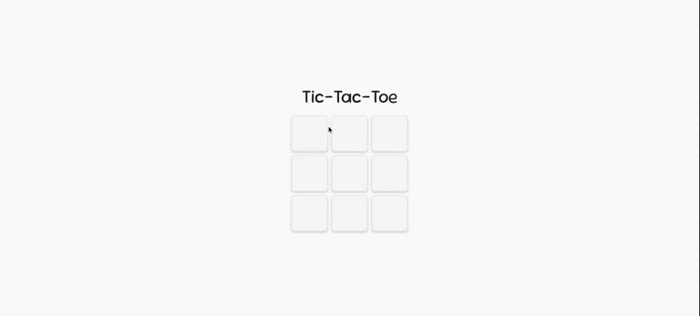

# TicTacToe

## Описание

Проект представляет собой реализацию игры "Крестики-Нолики". Данный проект является клиент-серверным приложением, в котором клиент взаимодействует с веб-сервером при помощи браузера. Логика веб-приложения распределена между сервером и клиентом, хранение данных осуществляется преимущественно на сервере, обмен информацией происходит по сети. Реализована поддержка нескольких игр одновременно.

## Требования

- Установленный `Docker`

## Установка и Запуск

- Клонировать репозиторий: `git clone git@github.com:Mark-Borzov/TicTacToe.git`
- Перейти в директорию проекта: `cd TicTacToe`
- Осуществить сборку проекта при помощи команды: `./gradlew build`
- Выполнить команду для сборки образа: `docker build -t tic-tac-toe-image .`
- Запустить контейнер при помощи команды: `docker run -d --name tic-tac-toe-container -p 8080:8080 tic-tac-toe-image`
- Открыть браузер и перейти по ссылке: `http://localhost:8080`